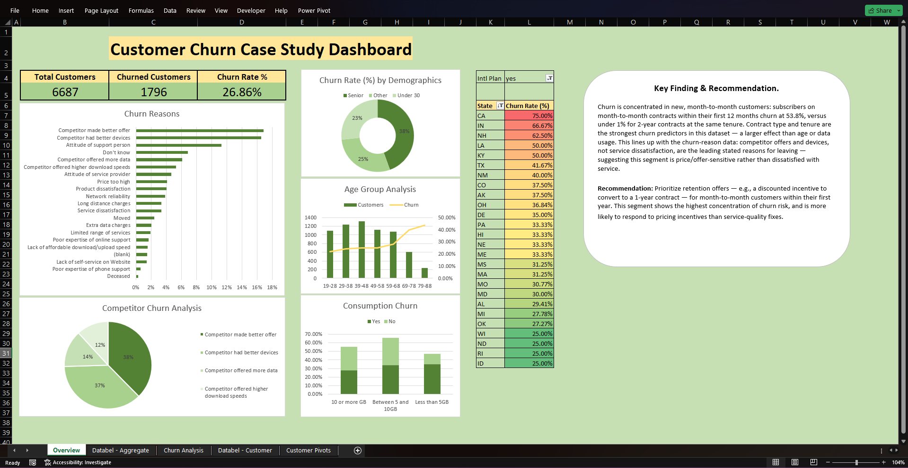

# Customer Churn Case Study In Excel

An Excel churn analysis that traced a `#DIV/0!` error back to a silently-blanked source column — and used the fix to uncover which of 6,687 telecom customers are actually at risk, and why.

**Tool(s):** Microsoft Excel &nbsp;·&nbsp; **Type:** DataCamp Course Project — Extended (see below) &nbsp;·&nbsp; **Dataset:** Simulated

---

## Preview

---

## Overview

An interactive Excel dashboard analysing churn drivers across 6,687 telecom customers, segmenting by contract type, tenure, age, data usage, and international plan status — paired with a written finding and recommendation, and a data-integrity investigation that shaped the final calculations.

---

## Beyond the Original Course

DataCamp's "Case Study: Analyzing Customer Churn in Excel" is a short, beginner-level course built around three fixed steps: exploring the dataset, investigating churn patterns with PivotTables, and arranging the resulting charts into a dashboard-style sheet. The provided dataset already included both the `Databel – Customer` and `Databel – Aggregate` tables from the start — that part isn't an extension. What the course doesn't ask for is reconciling the two tables against each other or drawing a stated conclusion from the result.

| | Original Course Project | This Version |
|---|---|---|
| Analysis | Guided PivotTable exercises across the provided Customer and Aggregate tables | Independent investigation cross-checking the two tables, tracing a `#DIV/0!` error to a rollup flaw affecting non-Senior customers. |
| Conclusion | Dashboard-style sheet arrangement | A written Key Finding & Recommendation translating the pivots into a stated conclusion and action. |

---

## Key Findings

1. **Churn is concentrated in new, month-to-month customers.** Subscribers on month-to-month contracts within their first 12 months churn at **53.8%**, versus under **1%** for 2-year contracts at the same tenure.
2. **Contract type and tenure are the strongest churn predictors in this dataset** — a larger effect than age or data usage.
3. **This lines up with the churn-reason data.** Competitor offers and devices, not service dissatisfaction, are the leading stated reasons for leaving — suggesting this segment is price/offer-sensitive rather than dissatisfied with service.

Taken together, this points toward prioritizing retention offers — such as a discounted incentive to convert to a 1-year contract — specifically for month-to-month customers within their first year. This segment carries the highest concentration of churn risk, and given that competitor offers rather than dissatisfaction are driving it, is more likely to respond to pricing incentives than service-quality fixes.

---

## Data Integrity

The source data included two tables: an individual-level customer table (`Databel – Customer`) and a pre-aggregated rollup (`Databel – Aggregate`).

Investigation into a row-count mismatch between the two revealed the rollup silently blanked several fields — Contract Type, Payment Method, Group, Churn Category, and Churn Reason — for every non-Senior customer before grouping.

- This meant any pivot table built on the rollup for those fields was unknowingly reflecting only the Senior subset (~18% of customers), not the full population.
- The affected calculation — churn rate by tenure and contract type — was identified via a `#DIV/0!` error traced back to this root cause, then rebuilt directly from the individual-level table (using `AVERAGE` on a binary churn flag) to reflect all 6,687 customers.
- Every other breakdown on the dashboard was audited field-by-field to confirm it didn't rely on the same blanked columns before being left on the original source.

---

## Features

- KPI summary cards (`Total Customers`, `Churned Customers`, `Churn Rate %`) alongside 5 pivot-driven charts — `Churn Reasons`, `Demographics`, `Age Group Analysis`, `Consumption Churn`, and `Competitor Churn Analysis`.
- Cross-referenced pivot tables across tenure, contract type, age bracket, data usage tier, and state (filtered to International Plan subscribers).
- Native Excel grouping applied to tenure into 12-month bands for readable trend comparison.
- A written Key Finding & Recommendation panel translating the pivot data into a stated conclusion and action, not just a set of tables.
- A documented data-integrity fix, tracing a `#DIV/0!` error back to a source-data limitation rather than treating it as a formatting issue.

---

## What's Inside

| File | Description |
|------|-------------|
| [`Customer Churn Case Study.xlsx`](Customer%20Churn%20Case%20Study.xlsx) | Full workbook. |
| [`Overview.png`](Overview.png) | Overview tab screenshot. |

---

## How to View

Download `Customer Churn Case Study.xlsx` and open it in Microsoft Excel (2016 or later recommended, for full PivotTable and grouping support). Start on the **Overview** tab; use the **Intl Plan** filter on the State breakdown to toggle between subscriber groups.

---

*Dataset is purely for analytical and educational purposes.*
