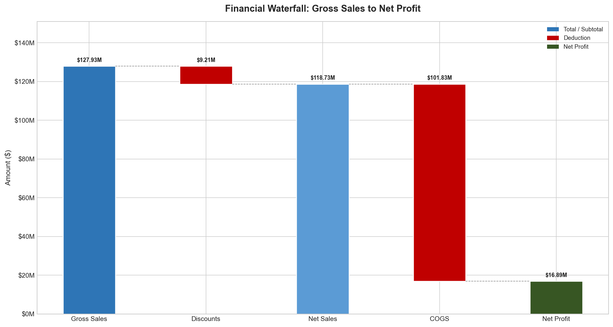
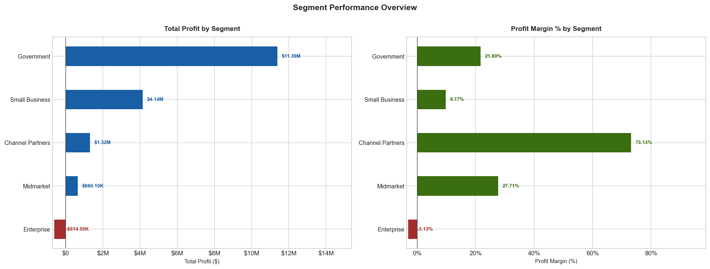
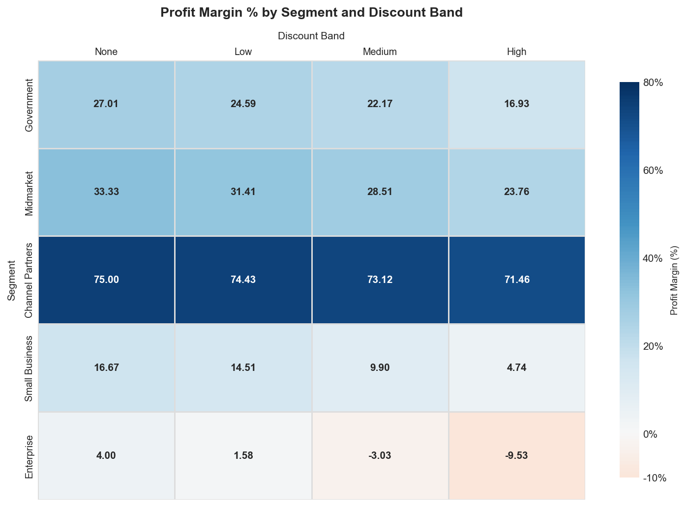
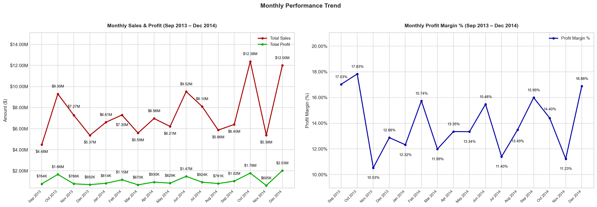
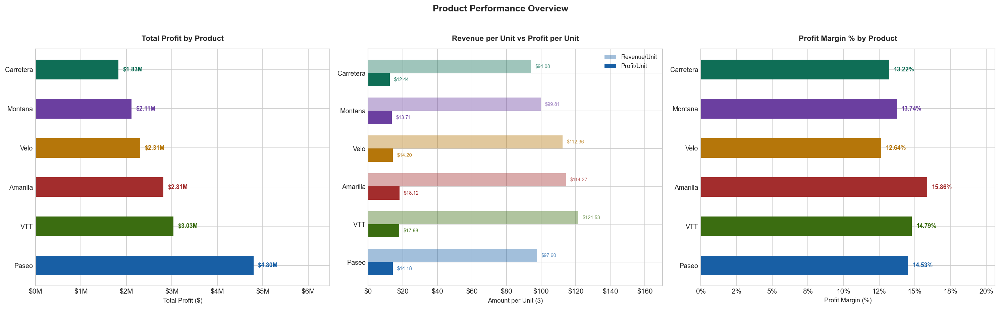
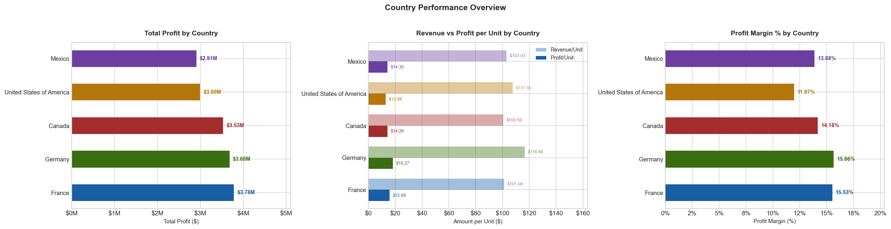

# Financial Analysis — SQL & Python

A structured financial analysis of a multi-segment, multi-country sales dataset, exploring profitability, discount impact, product performance, and seasonal trends using SQL and Python.

---

## Overview

This project analyses a dataset of 700 sales transactions spanning September 2013 to December 2014, covering five business segments, five countries, and six products. The raw data was loaded from Excel into PostgreSQL via Python, queried using SQL to surface patterns and anomalies, and then visualised using Matplotlib and Seaborn. The goal was to move beyond surface-level metrics and identify the structural factors driving — and limiting — profitability across the business.

---

## Tools & Libraries

- **Python** — pandas, NumPy, Matplotlib, Seaborn, SQLAlchemy, python-dotenv
- **SQL** — PostgreSQL (via pgAdmin)
- **Jupyter Notebook** — for analysis, visualisation, and documentation
- **Excel** — source dataset

---

## Key Findings

**Overall Performance**
The business generated $118.73M in gross sales across the period, with discounts and COGS reducing that to a net profit of $16.89M — a blended profit margin of 14.48%. While the headline numbers are healthy, the margin varies significantly across segments, products, and markets, pointing to structural inefficiencies worth addressing.

**Segment Performance — Enterprise is a Loss-Maker**
The Enterprise segment is the only loss-making segment, recording a profit margin of -3.13%. Investigation into discount bands confirms why: the higher the discount applied to Enterprise, the greater the loss. Channel Partners, by contrast, achieved the highest profit margin at 73.13%, with its pricing model showing strong resistance to discount pressure — losing only 3.54% in margin from no discount to high discount.

**Discount Structure — Discounts Hurt, But Not Equally**
Across all segments, higher discounts correlate with lower profit margins. The discount model is structurally sound for most segments, but catastrophic for Enterprise specifically, where it consistently produces negative returns regardless of volume.

**Product Performance — Amarilla Leads on Margin, Trails on Volume**
Amarilla has the highest profit margin at 15.86% and the highest profit per unit, making it the most efficient product in the portfolio. However, it has the second-lowest unit volume — a gap that signals a potential distribution or demand problem worth investigating.

**Country Performance — USA Revenue Does Not Convert to Profit**
The USA generated the highest net sales of any country but recorded the second-lowest total profit. Its second-highest COGS per unit suggests a cost base not matched by its pricing structure. Germany, by contrast, sold the fewest units yet posted the highest profit margin — pointing to stronger pricing discipline or a more favourable product mix.

**Time Trend — Partial 2013 Data Limits Year-on-Year Comparison**
The dataset covers September 2013 through December 2014, making a direct year-on-year revenue comparison unreliable. The more meaningful observation is on margin: despite higher revenue in 2014, profit margin declined by 0.58%, suggesting scaling came at a slight cost to profitability. A recurring profit drop every November across both years also stands out as a pattern warranting seasonal investigation.

---

## Project Structure

```
Financial-Analysis-Project/
│
├── financial_analysis.ipynb   # Main notebook — data loading, cleaning, SQL queries, charts, findings
├── financials.sql             # Full SQL analysis — exploratory queries with analytical commentary
├── Financial Sample.xlsx      # Source dataset
│
├── 1_financial_waterfall.png  # Gross Sales → Net Profit waterfall
├── 2_segment_performance.png  # Profit and margin by segment
├── 3_discount_analysis.png    # Discount band impact across segments
├── 4_monthly_trend.png        # Monthly sales, profit, and margin trend
├── 5_products_performance.png # Product profit, revenue/profit per unit, and margin
├── 6_country_performance.png  # Country profit, revenue/profit per unit, and margin
│
├── .env                       # Local environment variables (not pushed to GitHub)
└── .gitignore
```

---

## How to Run

1. **Clone the repository** and open the project folder in your terminal.
2. **Create a `.env` file** in the root directory with the following variable:
   ```
   DB_PASSWORD=your_postgresql_password
   ```
3. **Create a PostgreSQL database** named `financial_analysis` and ensure your local server is running on `localhost:5432` with the username `postgres`.
4. **Open `financial_analysis.ipynb`** in Jupyter and run all cells top to bottom. The notebook will load the Excel data, push it to PostgreSQL, query it, and render all six charts.

> The SQL file (`financials.sql`) is written for PostgreSQL and can be run independently in pgAdmin after the notebook has loaded the data.

---

## Charts







