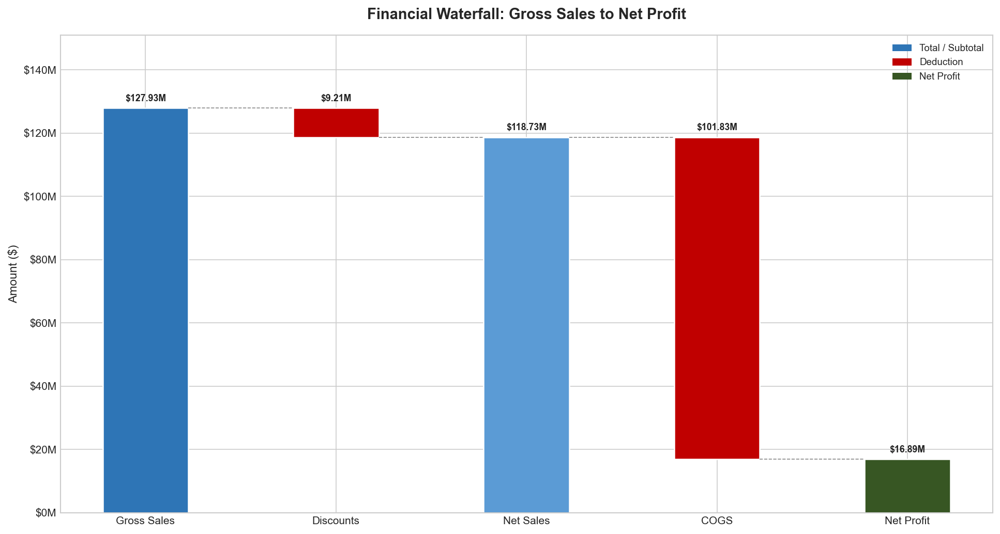
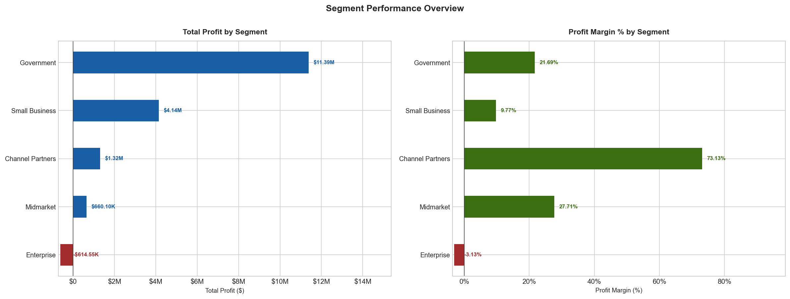
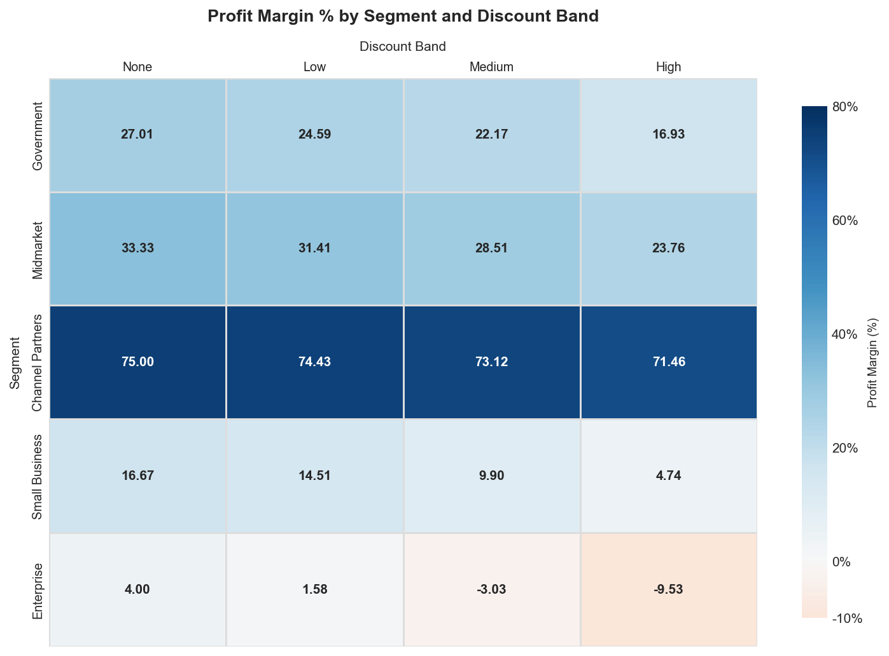
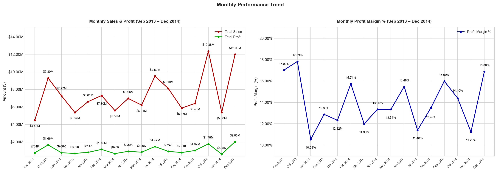
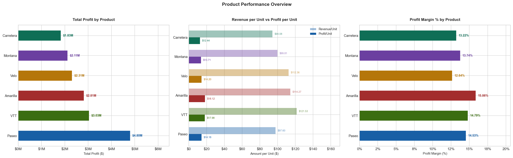
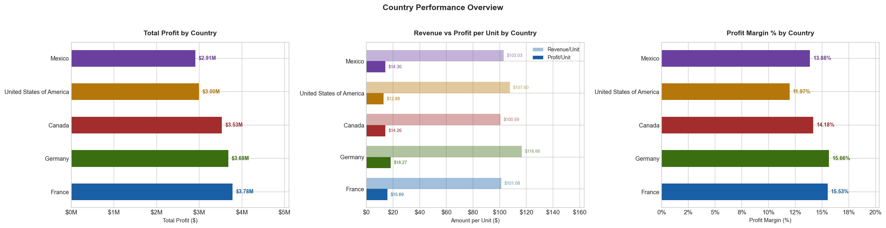

# Financial Analysis — SQL & Python

Five segments, five countries, six products — every headline figure checked back against the raw data, which is how a mislabeled "missing value" turned out to be an entire hidden discount category.

**Tool(s):** Python, SQL (PostgreSQL) &nbsp;·&nbsp; **Type:** Personal Project &nbsp;·&nbsp; **Dataset:** Microsoft's "Financial Sample" demo dataset

---

## Overview

This project analyzes a dataset of 700 sales transactions spanning September 2013 to December 2014, covering five business segments, five countries, and six products. The raw data was loaded from Excel into PostgreSQL via Python, queried using SQL to surface patterns and anomalies, and then visualised using Matplotlib and Seaborn. The goal was to move beyond surface-level metrics and identify the structural factors driving — and limiting — profitability across the business.

---

## Key Findings

1. **Overall performance is healthy, but uneven.** The business generated $127.93M in gross sales across the period; after discounts and COGS, that comes to $16.89M in net profit — a blended margin of 14.23%. That margin varies significantly across segments, products, and markets.
2. **Enterprise is the one loss-making segment.** It recorded a profit margin of -3.13%, and the higher the discount applied to Enterprise deals, the greater the loss. Channel Partners sits at the opposite extreme — the highest margin of any segment at 73.13%, and notably resistant to discount pressure, losing only 3.54 percentage points in margin from no discount to high discount.
3. **Discounting erodes margin in every segment — but only Enterprise's collapse turns it into a loss.** Margin falls from no-discount to high-discount deals across all five segments, but by wildly different amounts: Channel Partners moves just 3.54%, Midmarket 9.57, Government 10.08, Small Business 11.92 — and Enterprise moves 13.53%, from a profitable 4.00% at no discount down to -9.53% at high discount, the only segment to cross into loss territory.
4. **Amarilla leads on margin, trails on volume — but still wins on profit.** It has the highest profit margin of any product (15.86%) and the highest profit per unit ($18.12), yet the second-lowest unit volume in the portfolio. Velo sits at the other extreme — the lowest margin of the six products at 12.64%, just 3.22 percentage points below Amarilla — but moved more units and still returned less profit, a gap worth investigating as a possible distribution or demand issue rather than a pricing one.
5. **USA revenue doesn't convert to profit the way it should.** The USA generated the highest net sales of any country ($25.03M), but only the second-lowest total profit — its COGS per unit ($94.72) is the second-highest of any country, a cost base that isn't matched by its pricing. Germany is the inverse: fewest units sold, highest profit margin of any country (15.66% vs. USA's 11.97%, a 3.69-point gap), despite every country recording the exact same number of transactions (140).
6. **2014 grew, but margin slipped slightly.** Because the dataset only covers a partial 2013 (from September), a direct revenue comparison isn't reliable — but margin is: despite far higher revenue in 2014, profit margin declined from 14.68% to 14.10%, a 0.58-point drop. A recurring dip shows up every November in both years (10.53% in 2013, 11.23% in 2014, each a sharp fall from the preceding October), a pattern worth investigating on its own.

Enterprise is the finding that matters most here — a segment this large operating at a structural loss, specifically because of how it responds to discounting, is worth resolving before optimizing already-healthy segments like Channel Partners. The recurring November dip is the second thread worth pulling, since it shows up independently of any single segment or product.

---

## Data Integrity
An initial null check flagged 53 missing values in the Discount Band field. On inspection, these weren't missing data — Excel's source file used the literal string "*None*" to mean "*no discount applied*", and pandas misread that as a null. The values were restored using `fillna("None")`, leaving it with four real categories: None, Low, Medium, High, and zero actual nulls in the dataset.

---

## Charts

---

## Tools & Libraries

- **Python** — Pandas, NumPy, Matplotlib, Seaborn, SQLAlchemy, python-dotenv
- **SQL** — PostgreSQL (via pgAdmin)
- **Jupyter Notebook** — for analysis, visualisation, and documentation
- **Excel** — source dataset

---

## What's Inside

| File | Description |
|------|-------------|
| [`financial_analysis.ipynb`](financial_analysis.ipynb) | Main notebook — data loading, cleaning, SQL queries, charts, findings |
| [`financials.sql`](financials.sql) | Full SQL analysis — exploratory queries with analytical commentary |
| [`financial_sample.xlsx`](financial_sample.xlsx) | Source dataset |
| [`1_financial_waterfall.png`](1_financial_waterfall.png) | Gross Sales → Net Profit waterfall |
| [`2_segment_overview.png`](2_segment_overview.png) | Profit and margin by segment |
| [`3_discount_heatmap.png`](3_discount_heatmap.png) | Discount band impact across segments |
| [`4_monthly_trend.png`](4_monthly_trend.png) | Monthly sales, profit, and margin trend |
| [`5_products_performance.png`](5_products_performance.png) | Product profit, revenue/profit per unit, and margin |
| [`6_country_performance.png`](6_country_performance.png) | Country profit, revenue/profit per unit, and margin |

---

## How to Run

1. **Clone the repository** and open the project folder in your terminal.
2. **Create a `.env` file** in the root directory with the string **DB_PASSWORD** in cell block 7 replaced with your own PostgreSQL password.
3. **Create a PostgreSQL database** named `financial_analysis` and ensure your local server is running on `localhost:5432` with the username `postgres`.
4. **Open `financial_analysis.ipynb`** in Jupyter and run all cells top to bottom. The notebook will load the Excel data, push it to PostgreSQL, query it, and render all six charts.

> The SQL file (`financials.sql`) is written for PostgreSQL and can be run independently in pgAdmin after the notebook has loaded the data.

---

*Dataset is Microsoft's publicly available "Financial Sample" demo dataset, commonly used for BI and analytics tutorials — used here for independent analysis and educational purposes.*
