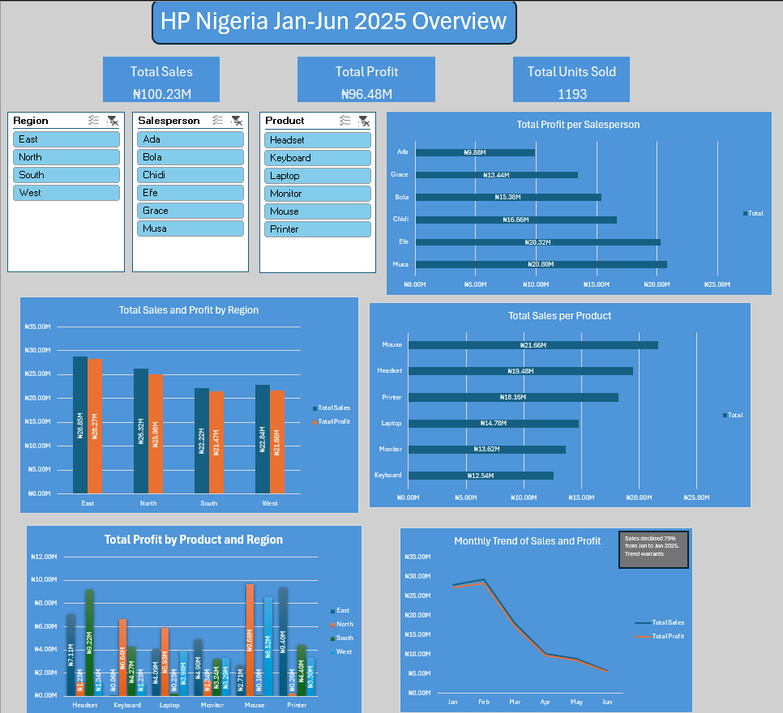

# HP Nigeria — Sales Performance Dashboard

**Tool:** Microsoft Excel

**Type:** Class Project | Simulated Dataset

An interactive Excel dashboard analysing H1 2025 sales performance for HP Nigeria
across 4 regions, 6 products, and 6 salespersons.

---

## Dashboard Preview

---

## What the Dashboard Covers

- **Which region generated the highest sales and profit** — East leads in both total sales and profit
- **Top 3 salespersons by profit** — Musa (₦20.80M), Efe (₦20.32M), and Chidi (₦16.66M)
- **Top product by sales** — Mouse at ₦21.66M across all regions
- **Monthly sales trend** — Sales declined 79% from January to June 2025, flagged with an annotation
- **Profit breakdown by product and region** — filterable by salesperson via slicer

---

## What's Inside

| File | Description |
|------|-------------|
| [`HP_Nigeria_Sales_Data.xlsx`](HP_Nigeria_Sales_Data.xlsx) | Original data set provided |
| [`Imran's_HP_Sales_Dashboard.xlsx`](Imran's_HP_Sales_Dashboard.xlsx) | The Excel dashboard file |
| [`hp_nigeria_dashboard_preview.png`](hp_nigeria_dashboard_preview.png) | Full dashboard screenshot |

---

## Features

- 5 pivot-driven visuals — regional sales & profit comparison, salesperson profit ranking,
  product performance, profit breakdown by product and region, and a monthly trend chart
- 3 slicers (Region, Salesperson, Product) enabling dynamic cross-filtering across all visuals
- Data labels on all charts for immediate readability without axis estimation
- Monthly trend annotation flagging the 79% sales decline from January to June 2025
- Designed to HP brand guidelines using a consistent blue and white colour theme

---

## How to View

Download `Imran_s_HP_Sales_Dashboard.xlsx` and open it in Microsoft Excel (2016 or later recommended).
Ensure macros are enabled if prompted, and use the slicers on the dashboard sheet to interact with the visuals.

---

*Dataset is simulated and used for analytical and educational purposes only.*
