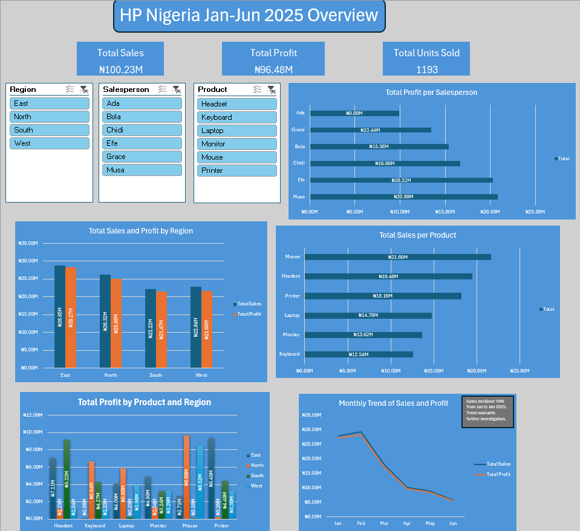

# HP Nigeria — Sales Performance Dashboard

A 79% sales collapse over six months — and a discovery that HP Nigeria's best-performing region isn't winning on volume, but on selling a fundamentally different mix of products.

**Tool(s):** Microsoft Excel &nbsp;·&nbsp; **Type:** Class Project &nbsp;·&nbsp; **Dataset:** Simulated

---

## Preview

---

## Overview

This dashboard analyzes H1 2025 sales performance for HP Nigeria across 4 regions, 6 products, and 6 salespersons, using PivotTables and slicers to let a viewer cross-filter sales and profit from multiple angles — by region, by salesperson, by product, and over time.

---

## Key Findings

1. **East leads on more than just size — it's winning on deal quality.** East is the top region on both total sales (₦28.85M) and profit (₦28.27M), but the more telling number is margin: East converts 98.00% of sales to profit, and earns ₦103,405 per unit sold — both the highest of any region, by a wide margin over North (₦72,507/unit) and West (₦77,407/unit). East isn't outselling the other regions by moving more units; it's earning more per transaction.

2. **West quietly has the weakest margin of any region.** West edges out South in total sales (₦22.84M vs. ₦22.22M), but converts less of it to profit — a 94.85% margin, the lowest of the four regions, versus South's 96.62%. On paper West looks like the stronger region; on margin, it isn't.

3. **Performance gap between top and bottom salesperson is more than 2x.** Musa (₦20.80M profit) and Efe (₦20.32M profit) lead the team, while Ada (₦9.88M) trails at less than half of Musa's output — a spread worth investigating rather than treating as expected variation.

4. **Mouse is the strongest product overall, but Monitor has the thinnest margin.** Mouse leads on both sales (₦21.66M) and profit (₦21.02M), confirming it as the genuine top performer rather than just a volume driver. Monitor, meanwhile, isn't the weakest product by sales (₦13.62M, mid-tier) but carries the lowest margin of all six products at 93.77%, meaningfully behind every other product (95.6%–97.3%).

5. **Sales declined 79% from January to June 2025** — from ₦27.95M to ₦5.87M — a collapse severe enough to flag as the dashboard's central concern rather than a background trend.

Taken together, the sales collapse is the one finding that outweighs the rest — a 79% drop in six months points to something structural rather than normal fluctuation, and it's worth investigating before anything else here. West and Monitor are also worth a second look on pricing or cost, since both are quietly underperforming on margin rather than volume — a gap that stays invisible if you only look at total sales.

---

## Features

- 5 pivot-driven visuals — regional sales & profit comparison, salesperson profit ranking, product performance, profit breakdown by product and region, and a monthly trend chart
- 3 slicers (Region, Salesperson, Product) enabling dynamic cross-filtering across all visuals
- Data labels on all charts for immediate readability without axis estimation
- Monthly trend annotation flagging the 79% sales decline from January to June 2025
- Designed to HP brand guidelines using a consistent blue and white colour theme

---

## What's Inside

| File | Description |
|------|-------------|
| [`hp_nigeria_sales.csv`](hp_nigeria_sales.csv) | Original data set provided. |
| [`hp_nigeria_sales_dashboard.xlsx`](hp_nigeria_sales_dashboard.xlsx) | Full workbook containing dashboard and analysis sheets. |
| [`1_overview.png`](1_overview.png) | Dashboard overview. |

---

## How to View

Download `hp_nigeria_sales_dashboard.xlsx` and open it in Microsoft Excel (2016 or later recommended). Use the slicers on the dashboard sheet to interact with the visuals.

---

*Dataset is simulated and used for analytical and educational purposes only.*
