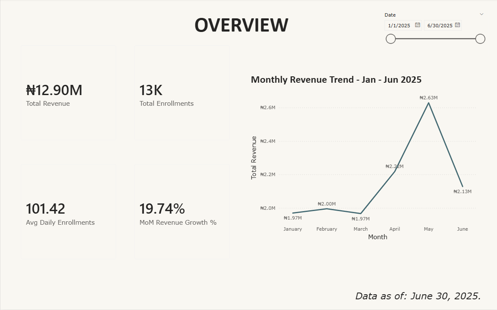

# Literate Nigeria — EdTech Performance Dashboard

**Tool:** Power BI

**Type:** Personal Project | Simulated Dataset Based on Real Organisation

A 3-page interactive Power BI dashboard tracking course enrollments and revenue across
19 courses in 5 categories, built around Literate Nigeria — a Lagos-based non-profit
providing digital skills education and scholarships to young Nigerians nationwide.

---

## Dashboard Preview

---

## What the Dashboard Covers

- **Monthly revenue trend** — tracking enrollment and revenue performance across January to June 2025
- **Course performance** — revenue and enrollment breakdown across 19 courses in 5 categories
- **Category insights** — comparing Technology, Design, Business, Finance, and Creative categories
- **Instructor attribution** — linking each instructor to their course's revenue and enrollment figures
- **Month-over-Month Revenue Growth %** — custom DAX measure tracking performance shifts between months

---

## What's Inside

| File | Description |
|------|-------------|
| [`Literate Nigeria PowerBI Project`](Literate%20Nigeria%20Project%20Upgraded.pbix) | The Power BI dashboard file |
| [`Source Dataset`](LiterateNigeria_Dataset_v2.xlsx) | Simulated source dataset (1,200+ rows) |
| [`Overview Page`](Overview.png) | Dashboard screenshot |
| [`Course Performance Page Page`](Course%20Performance.png) | Dashboard screenshot |
| [`Category & Instructor Insights Page`](Category%20&%20Instructor%20Insights.png) | Dashboard screenshot |
---

## Features

- 3 report pages — Overview, Course Performance, and Category & Instructor Insights
- Star schema data model across 3 related tables (Enrollments, Courses, Instructors)
  connected via Course ID as the primary relationship key
- 4 custom DAX measures:
  - Total Revenue
  - Total Enrollments
  - Average Daily Enrollments
  - Month-over-Month Revenue Growth % — using CALCULATE, DATEADD, and DIVIDE
- Cross-filtering slicers for dynamic analysis by date range and course category
- Consistent Frontier theme applied across all 3 pages

---

## Data Model

The dataset is structured as a star schema:

- **Enrollments** (fact table) — 1,200+ rows covering January to June 2025
- **Courses** (dimension table) — 19 courses across 5 categories with pricing and level details
- **Instructors** (dimension table) — 19 instructors linked to their respective courses via Course ID

---

## How to View

Download `Literate_Nigeria_Project_Upgraded.pbix` and open it in Power BI Desktop.

Power BI Desktop is free to download at [microsoft.com/powerbi](https://www.microsoft.com/en-us/power-platform/products/power-bi/desktop).

This is necessary to be able to go beyond just the screenshots and actually see the DAX measures used.

---

*Dataset is simulated and modelled after Literate Nigeria's actual course offerings.
Literate Nigeria is a real organisation based in Lagos, Nigeria — [literatenigeria.com](https://literatenigeria.com).*
