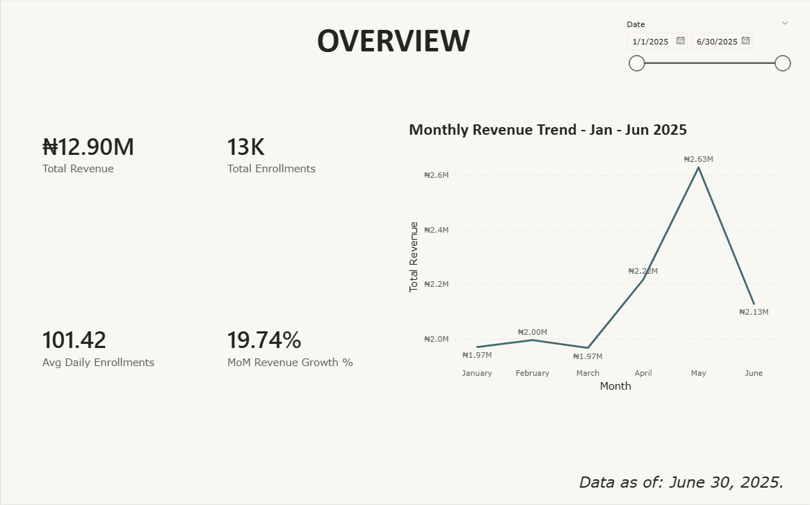
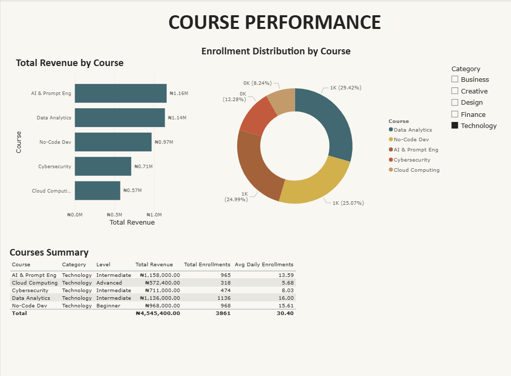
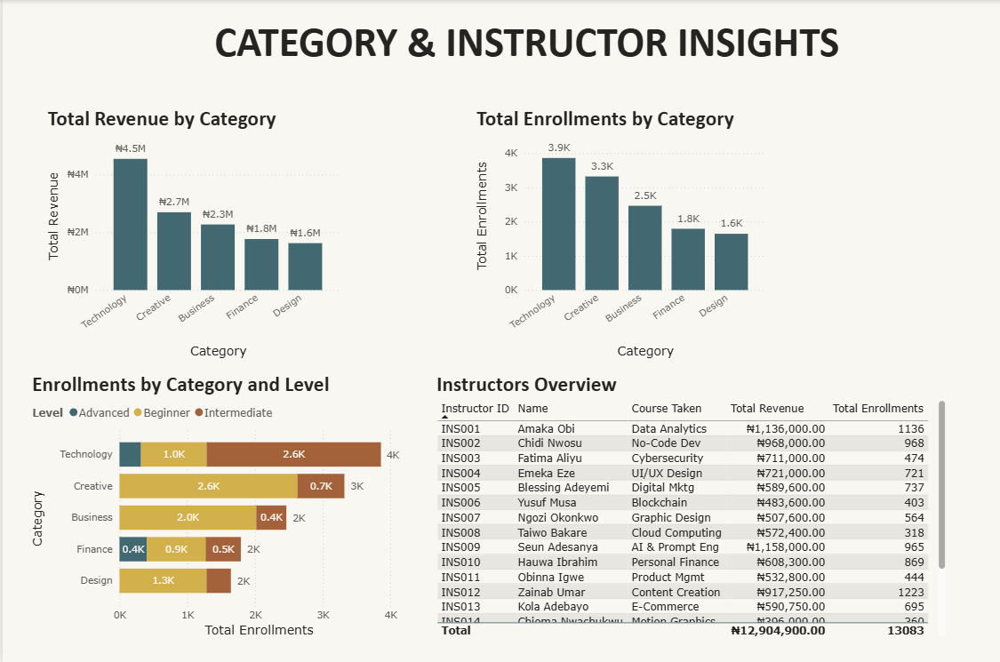

# Literate Nigeria — EdTech Performance Dashboard

What started as a 9-row course exercise, rebuilt into a 1,200+ row relational model spanning 19 courses — and used to trace a consistent volume-vs-value split running from category all the way down to individual course and instructor.

**Tool(s):** Power BI &nbsp;·&nbsp; **Type:** Course Project — Extended (see below) &nbsp;·&nbsp; **Dataset:** Simulated, expanded from original course dataset

---

## Preview

---

## Overview

A 3-page interactive Power BI dashboard tracking course enrollments and revenue across 19 courses in 5 categories, built around Literate Nigeria — a Lagos-based non-profit providing digital skills education and scholarships to young Nigerians nationwide.

---

## Beyond the Original Course

| | Original Course Project | This Version |
|---|---|---|
| Data | 9 rows, single table | 1,200+ rows across 3 relational tables. |
| Model | None | Star schema (Enrollments, Courses, Instructors). |
| Analysis | Basic totals | Category, level, and instructor-level breakdowns; 4 custom DAX measures. |
| Output | Single page | 3-page interactive report. |

---

## Data Model

The dataset is structured as a star schema:

- **Enrollments** (fact table) — 1,200+ rows covering January to June 2025.
- **Courses** (dimension table) — 19 courses across 5 categories with pricing and level details.
- **Instructors** (dimension table) — 19 instructors linked to their respective courses via Course ID.

---

## Key Findings

1. **Technology leads on both volume and value.** It's the top category by total revenue (₦4.545M) *and* the most efficient, earning the most per enrollment (₦1,177) of any category.
2. **Creative's revenue comes from volume, not pricing.** It's the #2 category by total revenue (₦2.70M), but has the lowest revenue-per-enrollment of any category (₦812) — its scale comes from enrollment count, not premium pricing.
3. **A consistent pricing tier runs from category level down to individual courses.** Advanced-level courses earn ~72% more per enrollment than Beginner courses (₦1,465 vs. ₦851), while drawing far fewer students (721 vs. 7,769 enrollments). The same pattern repeats at the course level: Cloud Computing (Advanced) has both the highest per-enrollment value of any single course (₦1,800) and the lowest enrollment count (318, last of 19); Content Creation (Beginner) is the mirror image — highest enrollment of any course (1,223) at one of the lowest per-enrollment values (₦750).
4. **The platform's peak month wasn't driven by one category.** May's revenue spike (₦2.63M) was broad-based — nearly every category grew, led by Design (+50%) and Creative (+23%), while Technology grew only modestly (+2.8%). June's pullback (₦2.13M) was equally broad, with every category declining.
5. **Instructor performance mirrors course performance.** Seun Adesanya (AI & Prompt Eng) generated the most total revenue (₦1,158,000); Taiwo Bakare (Cloud Computing) generated the most per enrollment (₦1,800) despite teaching the smallest class.

Together, these point to deliberate, correctly-functioning price tiering rather than pricing errors — Technology and Advanced-level courses are capturing more value per student by design, not by accident. The one open question is the May–June swing: since it moved almost every category in the same direction at the same time, it's more likely a platform-wide event (a promotion, a cohort start date) than something specific to any single course — worth checking against enrollment dates or marketing records rather than treating as solved.

---

## Dashboard Structure

| Page | Contents |
|---|---|
| [`Overview`](1_overview.png) | Total revenue, enrollments, average daily enrollments, MoM revenue growth %, and the monthly revenue trend. |
| [`Course Performance`](2_course_performance.png) | Revenue and enrollment breakdown across all 19 courses. |
| [`Category & Instructor Insights`](3_category_n_instructor_insights.png) | Revenue and enrollments by category, enrollments by category and level, and the full instructor overview table. |

---

## Charts

---

## Features

- 3 report pages — `Overview`, `Course Performance`, and `Category & Instructor Insights`.
- Star schema data model across 3 related tables (Enrollments, Courses, Instructors) connected via Course ID as the primary relationship key.
- 4 custom DAX measures:
  - Total Revenue
  - Total Enrollments
  - Average Daily Enrollments
  - Month-over-Month Revenue Growth % — using CALCULATE, DATEADD, and DIVIDE
- Cross-filtering slicers for dynamic analysis by date range and course category.
- Consistent Frontier theme applied across all 3 pages.

---

## What's Inside

| File | Description |
|------|-------------|
| [`literate_nigeria_project_upgraded.pbix`](literate_nigeria_project_upgraded.pbix) | Power BI dashboard file. |
| [`literate_nigeria_dataset_v2.xlsx`](literate_nigeria_dataset_v2.xlsx) | Simulated source dataset (1,200+ rows). |
| [`1_overview.png`](1_overview.png) | Overview page. |
| [`2_course_performance.png`](2_course_performance.png) | Course Performance page. |
| [`3_category_n_instructor_insights.png`](3_category_n_instructor_insights.png) | Category & Instructor Insights page. |

---

## How to View

Download `literate_nigeria_project_upgraded.pbix` and open it in Power BI Desktop (free at [microsoft.com/powerbi](https://www.microsoft.com/en-us/power-platform/products/power-bi/desktop)) — this is necessary to see the underlying DAX measures, not just the screenshots.

---

*Dataset is simulated and modelled after Literate Nigeria's actual course offerings, substantially expanded from Literate Nigeria's original 9-row "Data Analytics" course exercise for portfolio purposes. Literate Nigeria is a real organisation based in Lagos, Nigeria — [literatenigeria.com](https://literatenigeria.com).*
