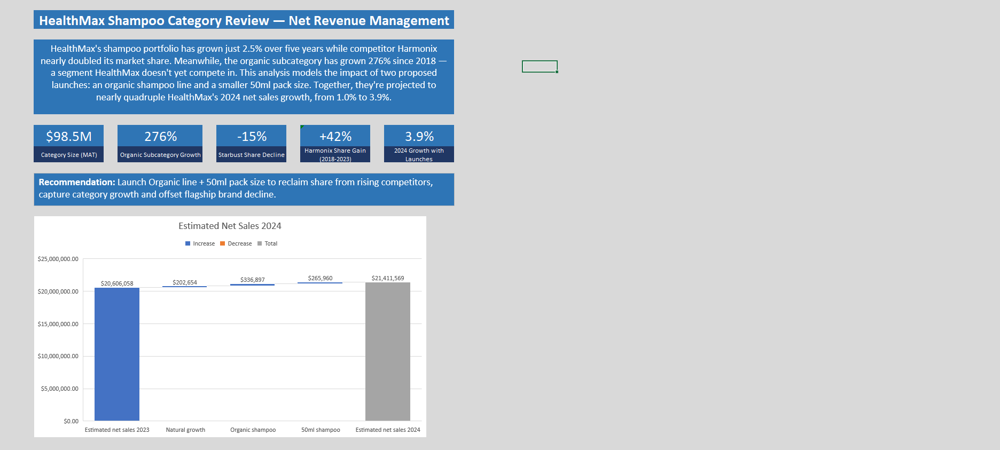
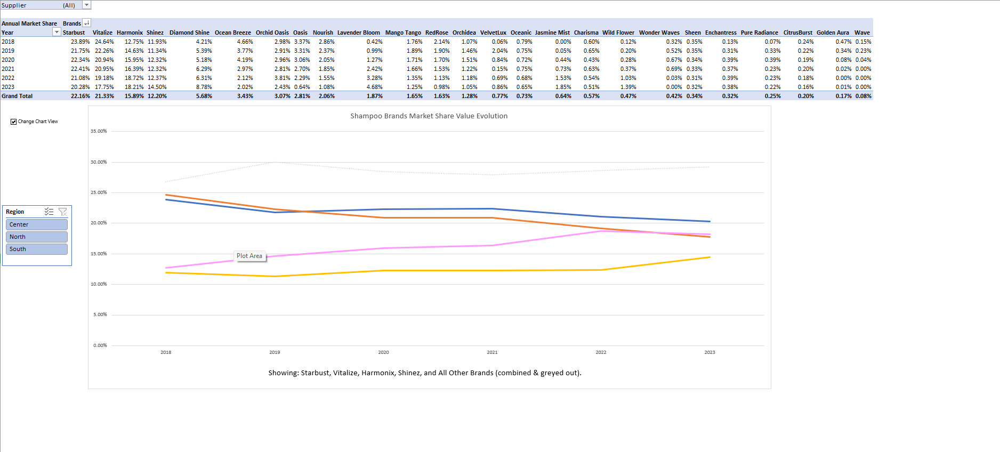
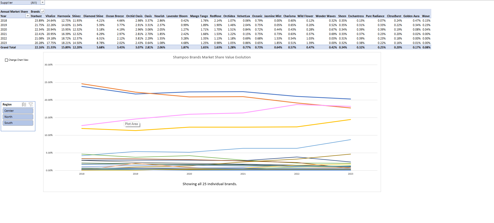
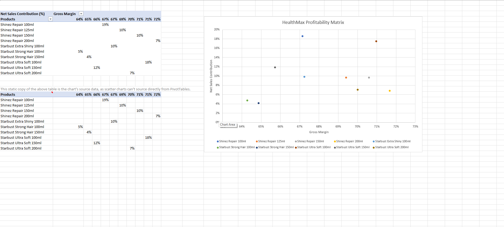
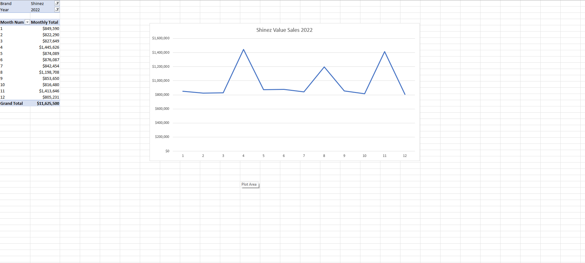
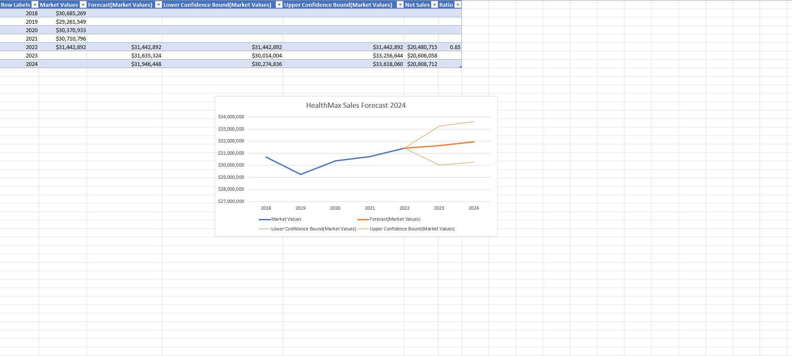
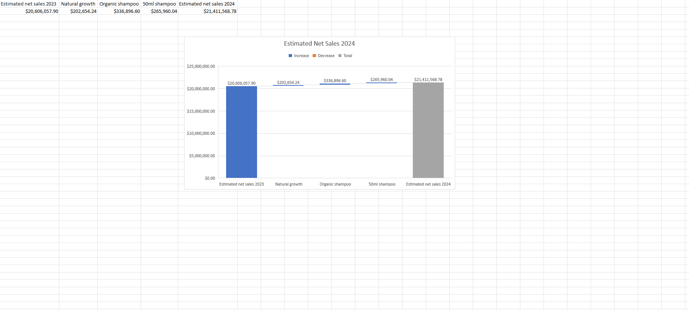

# Net Revenue Management Case Study (HealthMax Shampoo)

A DataCamp Net Revenue Management case study rebuilt around a single question — is HealthMax's stagnant growth a pricing problem or a portfolio problem — and extended with a fully interactive, macro-free toggle chart that most guided Excel courses never ask you to build.

**Tools:** Microsoft Excel &nbsp;·&nbsp; **Type:** Course Project — Extended (see below) &nbsp;·&nbsp; **Dataset:** Simulated (DataCamp course dataset)

---

## Preview

---

## Overview

A 17-sheet Excel workbook analyzing HealthMax's position in a $98.5M shampoo category — moving from raw retail-panel data through market share, growth, and profitability analysis to a quantified 2024 recommendation. The workbook is restructured entirely from its original guided-course form into a narrative-ordered deliverable (market context → competitive threat → growth opportunity → recommendation → financial payoff), anchored by a dedicated Executive Summary sheet.

---

## Beyond the Original Course

DataCamp's "Case Study: Net Revenue Management in Excel" is built around calculating category-manager KPIs — market share, YTD/MAT value growth, and a basic forecast — using PivotTables and VLOOKUP, working toward a business case by the end of the course. It doesn't ask for a stated executive summary, a reordered narrative structure, or an interactive chart.

| | Original Course Project | This Version |
|---|---|---|
| Structure | Guided PivotTable/KPI exercises across a single provided dataset | Restructured into a narrative-ordered 17-tab workbook (market context → competitive threat → growth opportunity → recommendation → financial payoff). |
| Executive Summary | None | Dedicated Executive Summary sheet with headline stat cards, a stated recommendation, and a linked chart. |
| Market Share Chart | Static PivotChart, all 25 brands plotted with no filtering beyond the pivot itself | Rebuilt as a macro-free, formula-driven interactive chart — a checkbox toggles between a full 25-brand view and a focused 4-competitor view, using a hidden helper sheet and conditional formulas. |
| Data Presentation | Raw pivot-table output only | Number formatting, duplicate-data, and typo corrections made throughout for a portfolio-ready deliverable. |

---

## Key Findings

1. **HealthMax's overall growth has been effectively flat.** Total sales grew just 2.5% over five years ($30.69M → $31.44M, 2018–2022).
2. **Starbust, HealthMax's largest brand, has lost share every year.** Its category share fell from 23.9% to 20.3% (2018–2023) — a 15% relative decline.
3. **Harmonix, a competitor, nearly doubled its share over the same window** (12.8% → 18.2%), overtaking longtime #2 player Vitalize by 2023.
4. **Organic is the fastest-growing subcategory in the market by far** (+276% in units, 2018 vs. 2022) — a segment HealthMax doesn't yet compete in.
5. **The Waterfall shows exactly what the proposed launches are worth.** Natural growth alone would add just 1.0% to 2024 net sales; with a proposed Organic line and 50ml pack size added, projected growth rises to 3.9% — the two launches account for roughly 75% of all projected 2024 growth.

Together, these five numbers are the backbone of the workbook's Executive Summary tab, which states the recommendation directly: launch the Organic line and 50ml pack size to reclaim share from rising competitors and offset flagship-brand decline. The Waterfall figure is the one that matters most here — it's the difference between treating the recommendation as a hunch and being able to quantify exactly what it's worth.

---

## Data Integrity / Methodology

**The Profitability Matrix's apparent duplicate table is intentional, not a mistake.** Excel doesn't allow scatter (XY) charts to be built directly from a PivotTable's data structure — a pivot cache has no concept of independent X/Y coordinates, so scatter, bubble, and stock charts are excluded from what a PivotChart can plot. The second, identical-looking table on that tab is a static copy of the same data, existing solely to give the scatter chart a plain cell range it can read from. This is documented directly in the workbook via a cell comment on the second table's header.

**The Market Share sheet's toggle chart is built without any VBA or macros**, specifically so the file opens with zero security warnings regardless of who opens it. A native Excel Form Control (a checkbox) is linked to a single cell, which drives conditional formulas on a hidden helper sheet — these formulas return either a brand's real value or Excel's `NA()` function, which the chart engine treats as "no data" and simply doesn't plot. Flipping the checkbox never touches the chart itself; it only changes what the underlying cells currently contain, and the chart redraws the way any Excel chart does when its source data changes.

---

## Charts

---

## Features

- A macro-free, formula-driven toggle on the Market Share chart — a checkbox switches between a full 25-brand view and a focused 4-competitor-plus-aggregate view, with a dynamic caption that updates to describe whichever state is active.
- A Region slicer cross-filtering the Market Share PivotTable, which flows through automatically to the toggle chart via its underlying formulas.
- 3 PivotTable-driven charts across the workbook (Market Share, Profitability Matrix, Promotion Graph).
- A native Excel Waterfall chart bridging prospected net sales of both 2023 and 2024, linked live into the Executive Summary sheet.
- A dedicated Executive Summary sheet with headline KPI callouts and a stated recommendation.

---

## What's Inside

| File | Description |
|------|-------------|
| [`NRM.xlsx`](NRM.xlsx) | Full 17-tab workbook. |
| [`1_overview.png`](1_overview.png) | Executive Summary sheet. |
| [`2_market_share_collapsed.png`](2_market_share_collapsed.png) | Market Share sheet — toggle in collapsed view. |
| [`3_market_share_full.png`](3_market_share_full.png) | Market Share sheet — toggle in full view. |
| [`4_profitability_matrix.png`](4_profitability_matrix.png) | Profitability Matrix sheet. |
| [`5_promotion_graph.png`](5_promotion_graph.png) | Promotion Graph sheet. |
| [`6_forecast_2024.png`](6_forecast_2024.png) | Forecast sheet. |
| [`7_waterfall.png`](7_waterfall.png) | Waterfall sheet. |

---

## How to View

Download `NRM.xlsx` and open it in Microsoft Excel (2016 or later — required for native Waterfall chart support). Start on the **Executive Summary** sheet. On the **Market Share** sheet, use the checkbox to toggle between the full and collapsed brand views, and the Region slicer to filter by geography.

---

*This project is based on DataCamp's "Case Study: Net Revenue Management in Excel." HealthMax, Shinez, Starbust, and all category data are fictional and provided as part of the course. The workbook restructuring, Executive Summary, and interactive Market Share chart are original extensions built substantially beyond the course's guided exercises.*
