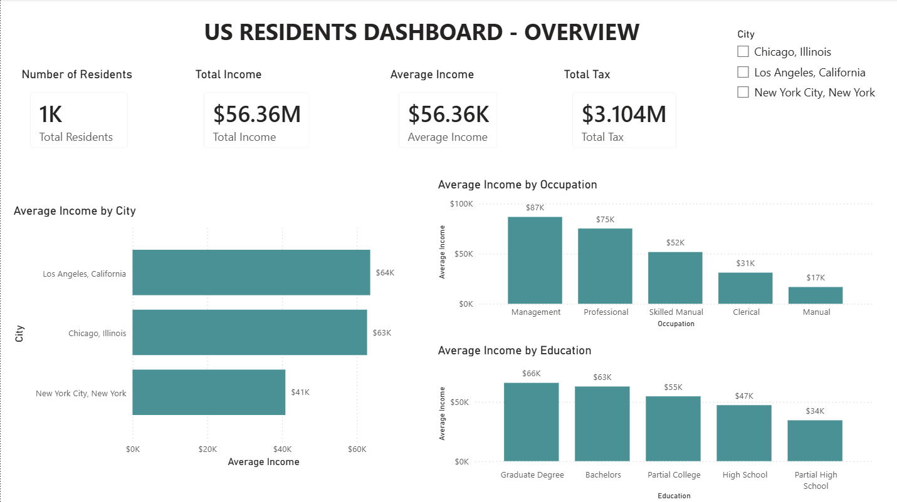
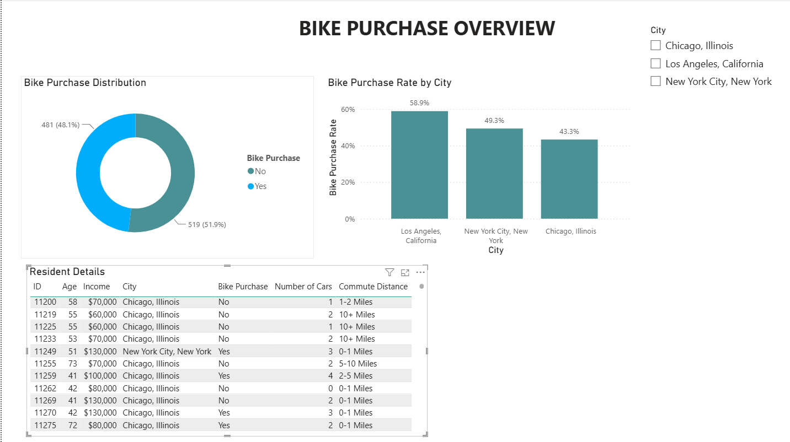
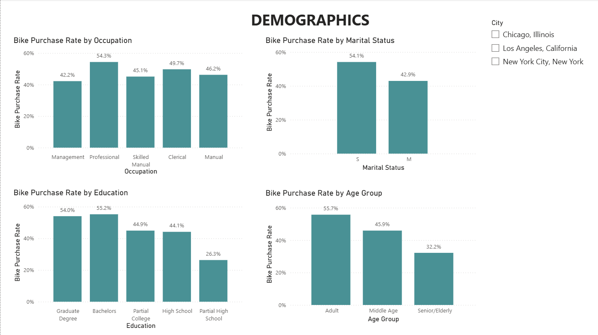
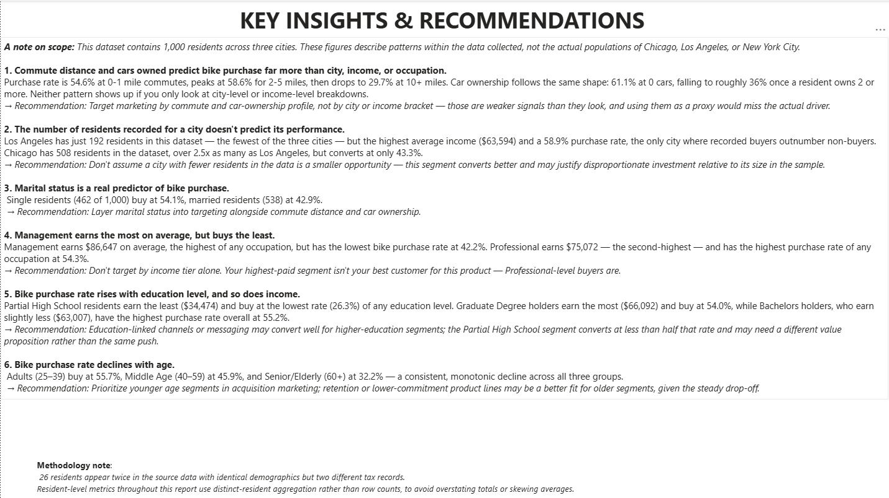

# US Residents Bike Purchase Analysis

A end-to-end exploratory analysis and interactive dashboard investigating what actually predicts bike purchases among 1,000 US residents across three cities — built to separate real signal from surface-level intuition.

**Tools:** MySQL · Power BI · DAX · Power Query

---

## A note on scope

This dataset contains 1,000 residents across three cities (Chicago, Los Angeles, New York City). Every finding in this project describes a pattern within the data collected — not a claim about the actual populations of these cities. Where a finding could be read as a statement about "the city" itself, it's phrased instead as a statement about the residents recorded in this dataset.

## Project overview

Given a raw dataset of resident demographics, income, and bike purchase behavior, the goal was to identify what genuinely drives a purchase decision — and, just as importantly, to identify which intuitive assumptions (city size, income level, gender) *don't* hold up once tested. The project moves from SQL-based exploratory investigation through to a 5-page interactive Power BI dashboard, with every insight on the dashboard traceable back to a specific query.

## Data integrity

The raw dataset contains 1,026 rows but only 1,000 unique residents — 26 residents appear twice, with identical demographic data but two different tax records. This was investigated and confirmed early, and shaped every calculation that followed:

- All resident-level counts and averages use **distinct-resident aggregation**, not row counts, to avoid double-counting the 26 duplicated residents.
- **Tax** is the one exception — since the two records per duplicated resident are genuinely different values, not repeated ones, `Total Tax` intentionally sums across all 1,026 rows.
- A dedicated deduplicated table was built in Power Query specifically for the resident-detail view, so no resident appears twice in the dashboard's table visual.

## Key findings

1. **Commute distance and cars owned are the strongest predictors of bike purchase** — far stronger than city, income, or occupation. Purchase rate rises from 54.6% at 0–1 mile commutes to a peak of 58.6% at 2–5 miles, then falls to 29.7% at 10+ miles. Car ownership shows a similar shape, falling from 61.1% (0 cars) to roughly 36% at 2+ cars.
2. **The number of residents recorded for a city doesn't predict its performance.** Los Angeles has the fewest residents in the dataset (192) but the highest average income and purchase rate (58.9%). Chicago has the most (508) but converts at only 43.3%.
3. **Marital status is a real, secondary predictor** — single residents buy at 54.1% vs. 42.9% for married residents. Gender was also tested and showed no meaningful difference (47.4% vs. 48.9%), and was ruled out as a segmentation variable.
4. **Management earns the most on average, but buys the least.** Professional — the second-highest earning group — has the highest bike purchase rate of any occupation. Income level does not predict purchase behavior on its own.
5. **Bike purchase rate rises with education level, and so does income** — the one variable where the two move together rather than reversing.
6. **Purchase rate declines steadily with age** — from 55.7% (Adult) to 45.9% (Middle Age) to 32.2% (Senior/Elderly), a clean, monotonic pattern.

Two additional variables — **Home Ownership** and **Number of Children** — were tested and are documented in the SQL script, but did not show a clean, reliable pattern and were not carried forward as dashboard findings.

## Dashboard structure

| Page | Contents |
|---|---|
| [Overview](1_overview.png) | Key metrics (Average Income, Total Income, Total Tax, Number of Residents) and average income breakdowns by City, Occupation, and Education |
| [Bike Purchase Overview](2_bike_purchase_overview.png) | Overall purchase distribution, purchase rate by city, and resident-level detail table |
| [Demographics](3_demographics.png) | Purchase rate by Occupation, Marital Status, Education, and Age Group |
| [Bike Purchase Drivers](4_bike_purchase_drivers.png) | Purchase rate by Commute Distance and by Cars Owned — the two strongest predictors found |
| [Key Insights & Recommendations](5_KIR.png) | Six findings, each paired with a concrete, actionable recommendation |

## Repository contents

- `us_residents_data.sql` — the full exploratory investigation, structured to read as a genuine analytical process: data integrity → summary statistics → the outcome variable → geography → demographics → occupation → education → behavioral drivers → life stage.
- `US_Residents_Data_Dashboard.pbix` — the 5-page interactive Power BI report.
- `US Residents Data.csv` — the source dataset.

## Handling the duplicate-resident distortion

Power BI's default implicit aggregations (`SUM`, `AVERAGE`) would silently double-count the 26 duplicated residents if applied directly to Income. `Average Income` and `Total Income` are both built as custom DAX measures (`AVERAGEX`/`SUMX` over distinct resident IDs) specifically to avoid this — full definitions are in the `.pbix` file's model view.

## Dashboard preview

**Overview**

**Bike Purchase Overview**

**Demographics**

**Bike Purchase Drivers**

**Key Insights & Recommendations**

## How to view

- **Power BI dashboard** — open `US_Residents_Data_Dashboard.pbix` in Power BI Desktop (free download from Microsoft). No data source connection or credentials needed; the dataset is embedded.
- **SQL script** — `us_residents_data.sql` is written to be read start to finish as a walkthrough of the investigation, not just executed. If you'd like to run it yourself: import `US Residents Data.csv` into a MySQL database as a table named `raw_residents_data`, then run the script top to bottom in MySQL Workbench (or any MySQL client) — it will build its own `income_cleaned` view along the way.
